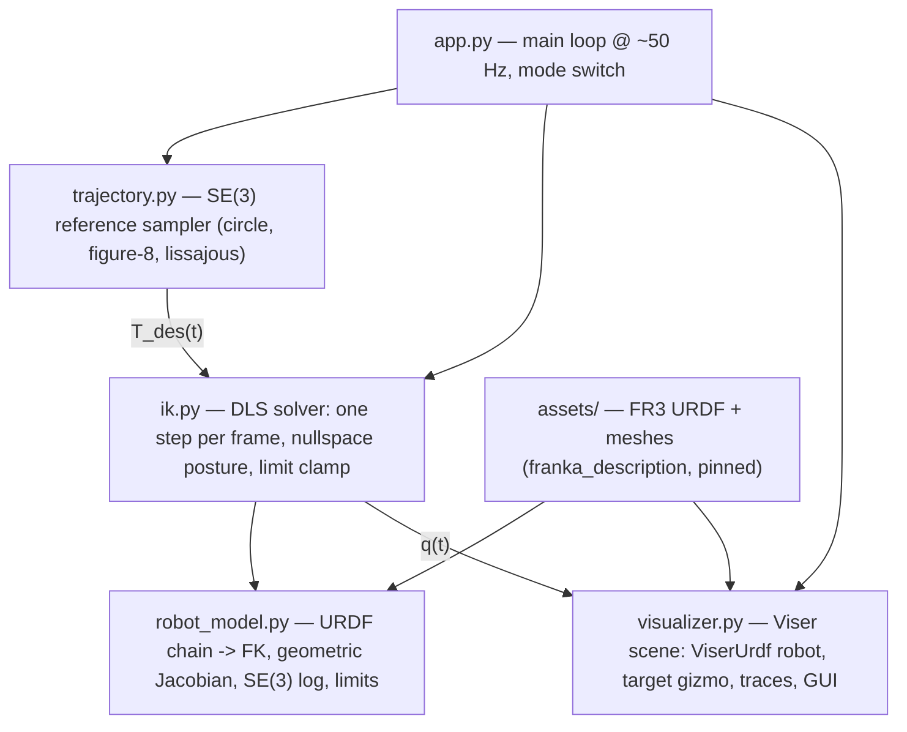

# System Design — Franka FR3 Inverse Kinematics with Viser Visualization

**Status:** draft for review — decisions D1/D2 proposed, not yet locked.

---

## 1. Problem statement

**Task (as assigned):** Implement inverse kinematics (IK) for a Franka robot arm using the
kinematic model from [`frankarobotics/franka_description`](https://github.com/frankarobotics/franka_description),
and visualize it in [Viser](https://viser.studio). Sample an end-effector pose trajectory
and drive the arm with IK so the end effector follows the reference trajectory.

Stated precisely: *given a desired pose for the robot's hand, compute the joint angles
that put the hand there — continuously, so the hand follows a moving target smoothly.*

The Franka FR3 is a 7-joint serial arm; its configuration is a joint-angle vector
\( q \in \mathbb{R}^7 \). Two directions exist between joint space and hand space:

- **Forward kinematics (FK)** — the easy direction. Given \( q \), walk down the chain of
  links (each joint contributes a known rotation about a known axis, read from the URDF)
  and multiply transforms to get the hand pose \( T \in SE(3) \). Deterministic,
  closed-form, one matrix product per joint.
- **Inverse kinematics (IK)** — the hard direction, and our actual task. Given a desired
  pose \( T_{des} \), find \( q \) with \( f(q) = T_{des} \). Hard because \( f \) is
  nonlinear, solutions are non-unique (7 joints vs. 6 pose DoF — the "elbow" can swing
  freely along a one-dimensional family of valid arm shapes), and some poses have no
  solution (out of reach).

### Inputs, outputs, success criteria

| | |
|---|---|
| **Input (per instant)** | Target pose \( T_{des}(t) \): sampled from a parametric trajectory (playback mode) or a user-dragged gizmo (interactive mode) |
| **Output (per instant)** | Joint vector \( q(t) \), within FR3 joint limits, varying smoothly (no jumps) |
| **Success (qualitative)** | The rendered arm's hand visibly rides the reference path in a live browser demo |
| **Success (quantitative)** | Static solves converge to < 1 mm position / < 0.5° orientation error; tracking error during playback stays at the mm / sub-degree level |

### Deliverable

A browser-based Viser demo where the FR3 tracks reference end-effector trajectories,
plus a presentable artifact (see decision D2): demo recording, tracking-error plots,
and this document evolved into a short report.

---

## 2. Approach: damped least-squares differential IK

We solve IK iteratively by repeatedly linearizing FK. Per iteration:

1. **Pose error:** \( e = \log(T_{ee}^{-1} T_{des}) \in \mathbb{R}^6 \) — a twist
   (3 translational + 3 rotational components) measuring "how far and how twisted"
   the current hand pose is from the target.
2. **Jacobian:** \( J(q) \in \mathbb{R}^{6 \times 7} \), the matrix relating joint
   velocities to end-effector twist. This is the linchpin: it linearizes the nonlinear
   FK locally. For a serial chain each column has a closed form from the joint axis
   \( \hat z_i \) and the lever arm to the end effector:
   column \( i = [\, \hat z_i \times (p_{ee} - p_i);\ \hat z_i \,] \) (revolute joints).
3. **Damped least-squares (DLS) step:**
   \( \Delta q = J^\top (J J^\top + \lambda^2 I)^{-1} e \).
   The damping \( \lambda \) keeps the step bounded near singular configurations,
   where a plain pseudoinverse blows up (Levenberg–Marquardt style regularization).
4. **Redundancy resolution (nullspace posture task):** the spare 7th DoF is used to
   bias the arm toward a comfortable home configuration without disturbing the hand:
   \( \Delta q_{null} = (I - J^{+} J)\, k_{posture} (q_{home} - q) \).
5. **Integrate and clamp:** \( q \leftarrow \mathrm{clip}(q + \alpha \Delta q,\ q_{min},\ q_{max}) \);
   repeat until \( \|e\| \) < tolerance (static solve) or once per render frame
   (tracking a moving target).

Why this method (vs. alternatives considered):

- **Analytic IK** (closed-form, e.g. franka_analytical_ik): exact and fast but specific
  to one kinematic structure, doesn't demonstrate the general method, and handles the
  redundant DoF by fixing a parameter. Wrong fit for a "show you can build IK" exercise.
- **Full nonlinear optimization** (e.g. PyRoki's Levenberg–Marquardt over costs): powerful
  and general, but the point of the exercise is to implement the solver ourselves, not
  to configure someone else's.
- **Differential/DLS IK** (chosen): the standard textbook method, ~30 lines for the core
  loop, naturally handles tracking (one step per frame), singularity-robust, and easy to
  extend with the nullspace task. All of it is ours.

---

## 3. Exploratory findings (tool & data landscape, July 2026)

Research done up front so decisions below are grounded:

- **Viser** is at v1.0.27 (May 2026). `viser.extras.ViserUrdf` renders a URDF and
  exposes `update_cfg(q)` for per-frame joint updates; `scene.add_transform_controls`
  provides the drag gizmo; GUI sliders/dropdowns/plots are built in. Viser has a citable
  technical report ([arXiv:2507.22885](https://arxiv.org/abs/2507.22885)).
- **franka_description** does not ship URDFs; they are generated by
  `python3 scripts/create_urdf.py fr3 --robot-ee franka_hand` from the repo root
  (output in `urdfs/`). Community reports warn that `--abs-path` produces URDFs that
  break downstream; the safer route is generating with default `package://` paths and
  rewriting them to paths relative to the repo checkout.
- **Pinocchio** (the standard rigid-body kinematics library) is **no longer
  pip-installable on macOS** — as of `pin` 4.x the PyPI wheels are Linux-only; macOS
  requires conda-forge. This matters because the dev machine is an Apple Silicon Mac.
- **PyRoKi** ([arXiv:2505.03728](https://arxiv.org/abs/2505.03728), IROS 2025, same
  Berkeley group as Viser) is a pip-installable JAX toolkit for kinematic optimization
  with its own URDF FK. Useful to us not as a solver but as an independent reference
  implementation to validate our FK/Jacobian against.
- **yourdfpy** parses URDFs and is already a Viser dependency — we get joint origins,
  axes, and limits from it for free.
- **Data:** there is no dataset in the ML sense. The only external data is the FR3
  robot description — joint geometry/limits (URDF) and visual meshes — from
  `frankarobotics/franka_description`, pinned in `assets/`.

---

## 4. Design decisions

### D1 — Kinematics backend (FK, Jacobian, pose error) — *proposed: from scratch + validation*

The assignment allows a library for the standard kinematics calculations. Options:

| Option | Pros | Cons |
|---|---|---|
| **A. Pinocchio** | Battle-tested; zero kinematics debugging | conda-only on macOS; heavier setup; less "from scratch" |
| **B. Our own numpy FK/Jacobian** | Whole pipeline is ours; pure-pip repo; demonstrates understanding | One more thing to get wrong |
| **C. B + validation script vs. PyRoKi** *(proposed)* | All of B, plus numerical proof of correctness | Small extra script |

**Proposed: C.** FK for a 7-joint serial chain is a loop of 4×4 transform products read
from URDF joint frames (via yourdfpy); the geometric Jacobian is the closed form in §2.
A `validate_kinematics.py` script cross-checks our FK and Jacobian against PyRoKi's on
random configurations (agreement to ~1e-6), and FK is also visually confirmed against
the Viser-rendered hand frame (M2). The SE(3) log map (pose error) is ~15 lines
(rotation log + V-inverse) implemented with the same rigor.

### D2 — Presentable artifact — *proposed: GIF + plots + report, no slides*

1. **GIF / short recording in the README** — arm smoothly tracing a figure-8; the
   10-second version that gets watched first. Non-negotiable.
2. **Tracking-error plots** — reference vs. achieved position, error in mm / deg over
   time, produced by a headless `record.py` run. The quantitative evidence.
3. **Report** — this document extended with results and references.
4. ~~Slide deck~~ — skipped; duplicates the report. The repo is the presentation.

### D3 — Publication — *decided: public GitHub repo*

Public repo `franka-ik-viser` under `nilakarthikesan` (GitHub CLI already
authenticated). Created and pushed at M0 so history shows incremental progress.

---

## 5. System architecture



Per-frame data flow (playback mode): trajectory clock → \( T_{des}(t) \) → one DLS step
→ \( q_{t+1} \) → Viser joint update + trace/error readout. In interactive mode the
gizmo pose replaces the trajectory sample; everything downstream is identical.

### Components

- **`robot_model.py`** — parses the generated FR3 URDF with yourdfpy; extracts the
  7 revolute arm joints (fingers excluded → exactly 7 DoF); exposes `fk(q) -> 4x4`,
  `jacobian(q) -> (6,7)`, `pose_error(T, T_des) -> (6,)` (SE(3) log), joint limits,
  `q_home`, EE frame `fr3_hand_tcp`.
- **`ik.py`** — `DLSSolver` with `solve_step(q, T_des)` (one iteration, used for
  tracking) and `solve(q0, T_des)` (iterate to convergence for static targets).
  Tunables: damping λ, step scale α, position/rotation error weights, posture gain.
- **`trajectory.py`** — parametric SE(3) paths (circle, figure-8, lissajous) centered
  ~[0.45, 0, 0.45] m in front of the base, radius ≤ 0.15 m (well inside the ~0.85 m
  reach envelope); default gripper-down orientation, optional slerped keyframes.
- **`visualizer.py`** — ViserUrdf robot, reference path line, live EE trace, target
  gizmo, GUI (mode/trajectory dropdowns, speed + gain sliders, error readout in mm/deg).
- **`app.py`** — the ~50 Hz loop tying it together.
- **`record.py`** — headless playback run → per-step error CSV + matplotlib plots.
- **`validate_kinematics.py`** — FK/Jacobian cross-check vs. PyRoKi (decision D1).

### Repository layout

```
franka-ik-viser/
├── DESIGN.md               ← this document (becomes the report)
├── README.md               ← quickstart + GIF + results
├── requirements.txt        ← viser, yourdfpy, numpy, matplotlib (+ pyroki for validation)
├── assets/                 ← franka_description checkout + generated FR3 URDF
└── src/franka_ik/
    ├── robot_model.py  ├── ik.py  ├── trajectory.py
    ├── visualizer.py   ├── app.py ├── record.py
    └── validate_kinematics.py
```

---

## 6. Execution plan (milestones)

| # | Milestone | Definition of done |
|---|-----------|--------------------|
| M0 | Environment + repo | Python ≥3.10 venv; `pip install -r requirements.txt` clean; franka_description cloned into `assets/`, FR3 URDF generated with relative mesh paths; public GitHub repo created and pushed |
| M1 | Render | FR3 renders in a Viser browser tab with joint sliders |
| M2 | Kinematics verified | Our FK matches PyRoKi + the Viser-rendered EE frame on random configs; Jacobian matches finite differences and PyRoKi |
| M3 | Static IK | Solver converges to random reachable targets (< 1 mm, < 0.5°) |
| M4 | Tracking | Arm follows circle/figure-8; reference vs. achieved traces drawn live; error CSV/plot from `record.py` |
| M5 | Interactive | Drag gizmo, arm follows in real time; GUI polish |
| M6 | Artifact | GIF recorded and embedded; plots in README; report finalized with references |

## 7. Risks & mitigations

- **URDF generation friction** (`package://` mesh paths, script quirks): generate without
  `--abs-path`, rewrite mesh paths to relative; fallback to the `robot_descriptions`
  package's ready-made FR3/Panda if blocked.
- **Our FK/Jacobian is wrong:** the whole point of M2 — validate against PyRoKi and
  finite differences before any IK work builds on it.
- **Singularity / joint-limit weirdness while tracking:** DLS damping, trajectories kept
  in a comfortable workspace region, nullspace posture task keeps the elbow sane.
- **Old system Python (3.9):** create the venv from a ≥3.10 interpreter (PyRoKi needs
  3.10+; viser needs ≥3.8).

## 8. Stretch goals (only if time remains)

- Side-by-side toggle: our DLS solver vs. PyRoKi's optimizer on the same target.
- Manipulability ellipsoid visualization at the EE.
- Orientation-weighting toggle (position-only vs. full 6D IK).

## References

- franka_description — official Franka robot models: https://github.com/frankarobotics/franka_description
- B. Yi et al., *Viser: Imperative, Web-based 3D Visualization in Python*, arXiv:2507.22885
- C. M. Kim*, B. Yi* et al., *PyRoki: A Modular Toolkit for Robot Kinematic Optimization*, IROS 2025, arXiv:2505.03728
- S. R. Buss, *Introduction to Inverse Kinematics with Jacobian Transpose, Pseudoinverse and Damped Least Squares Methods*, 2004 (the classic DLS reference)
