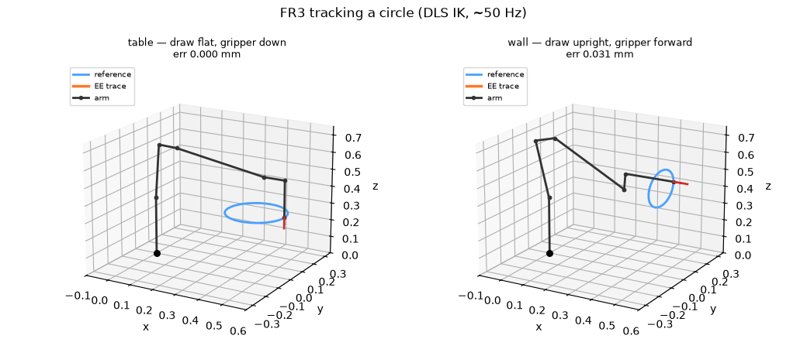

# Franka FR3 Inverse Kinematics

[](https://github.com/nilakarthikesan/franka-ik-viser/actions/workflows/ci.yml)

A NumPy implementation of forward kinematics, an analytic geometric Jacobian, and damped least-squares inverse kinematics for the seven-joint Franka FR3. A [Viser](https://viser.studio) app displays trajectory tracking and an interactive target gizmo.

The solver includes joint-limit handling, a bounded per-step update, and a nullspace posture term. The robot geometry comes from the official Franka URDF and meshes. `yourdfpy`, PyRoKi, and finite differences provide independent numerical comparisons.

## Demo



The blue curve is the target; orange is the end-effector position calculated by forward kinematics. The report records maximum circle errors of 0.008 mm on the table path and 0.031 mm on the wall path. These are numerical errors in the kinematic model, rather than physical robot accuracy.

## Setup and run

Use Python 3.10 or later:

```bash
python3 -m venv .venv
source .venv/bin/activate
pip install -r requirements.txt
git clone https://github.com/frankarobotics/franka_description assets/franka_description
python scripts/generate_urdf.py
python scripts/verify_setup.py
python scripts/validate_kinematics.py
python scripts/test_ik.py
python scripts/test_trajectory.py
PYTHONPATH=src python -m franka_ik.app
```

Select a circle, figure-eight, or Lissajous path and a table or wall surface. Interactive mode follows the target gizmo. To generate tracking CSVs and plots:

```bash
PYTHONPATH=src python -m franka_ik.record --all --periods 2
```

## Validation and limits

[REPORT.md](REPORT.md) documents numerical checks for FK, Jacobians, static targets, singularities, joint limits, and sampled tracking paths. The six shape/surface combinations are exercised over two periods in the tracking test.

There is no physical robot deployment, collision checking, or joint velocity/acceleration controller in this project. A per-step bound limits numerical updates; it does not establish hardware-safe motion. The local IK solver can fail to converge on unreachable or difficult targets. Tests on sampled configurations do not prove convergence for every pose.

See [DESIGN.md](DESIGN.md) for the design and [notes/](notes/) for derivations and implementation decisions.
