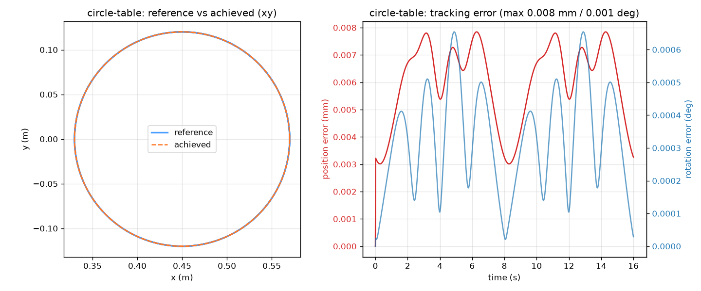
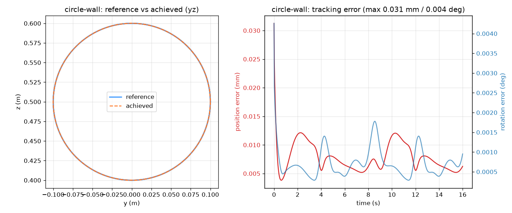

# franka-ik-viser

Inverse kinematics on a Franka FR3 arm, implemented from scratch (damped least squares)
and visualized live in [Viser](https://viser.studio). The end effector tracks sampled
SE(3) reference trajectories, or an interactive drag gizmo.

See [DESIGN.md](DESIGN.md) for the system design and [REPORT.md](REPORT.md) for the
end-to-end writeup (approach, results, references).

## Demo

The arm tracking a circle on both drawing surfaces — `table` (flat, gripper down) and
`wall` (upright, gripper forward). Blue = reference, orange = the live end-effector
trace, red = the gripper "pen" axis pointing into the drawing plane:


Tracking error stays at **micrometre scale** the whole loop (max 0.008 mm on `table`,
0.031 mm on `wall`):

| `table` (XY plane) | `wall` (YZ plane) |
|---|---|
|  |  |

## Quickstart

```bash
python3.12 -m venv .venv && source .venv/bin/activate   # any Python >= 3.10
pip install -r requirements.txt

# Get the official Franka robot models and generate the FR3 URDF.
# generate_urdf.py wraps franka_description's create_urdf.py (shims its ROS
# dependency) and rewrites mesh paths to be relative to the URDF.
git clone https://github.com/frankarobotics/franka_description assets/franka_description
python scripts/generate_urdf.py

# Check the setup (URDF data, joints, limits, EE frame, meshes)
python scripts/verify_setup.py

# Validate the from-scratch kinematics (FK/Jacobian vs yourdfpy, PyRoKi, FD)
python scripts/validate_kinematics.py

# Test the DLS IK solver (static convergence, singularities, limits, tracking)
python scripts/test_ik.py

# M1: render the arm with joint sliders (opens a Viser tab in your browser)
python scripts/render_m1.py

# Test trajectories + end-to-end tracking (reachability, continuity, error bars)
python scripts/test_trajectory.py

# Run the live IK demo (opens a Viser tab: playback + interactive gizmo modes).
# Pick a shape (circle / figure-8 / lissajous) AND a Surface: table (draw flat,
# gripper down) or wall (draw upright, gripper forward) — see notes §9.
PYTHONPATH=src python -m franka_ik.app

# Record tracking-error artifacts (CSV + plots in outputs/) for every shape x surface
PYTHONPATH=src python -m franka_ik.record --all --periods 2

# Render the tracking demo GIF (both surfaces) into docs/images/tracking.gif
PYTHONPATH=src python scripts/record_gif.py --shape circle --surfaces table wall
```

> The `franka_ik` package lives under `src/`. The `scripts/*.py` add it to the path
> automatically; for the `python -m franka_ik.*` entry points use `PYTHONPATH=src` as
> shown (or `pip install -e .`, which also works in non-iCloud-synced checkouts).

## Status

- [x] M0 environment + URDF generated (`scripts/generate_urdf.py`, `scripts/verify_setup.py`)
- [x] M1 robot renders in Viser with joint sliders (`scripts/render_m1.py`)
- [x] M2 from-scratch FK/Jacobian validated: 9/9 checks vs. yourdfpy, PyRoKi, finite differences, scipy (`scripts/validate_kinematics.py`)
- [x] M3 DLS solver: 50/50 static targets < 1 mm / 0.5 deg; circle tracking at 0.006 mm max error, 12/12 tests (`scripts/test_ik.py`)
- [x] M4 trajectory tracking (circle / figure-8 / lissajous on `table`/`wall` surfaces): 18/18 tests, all 12 combos < 0.031 mm / 0.005 deg (`scripts/test_trajectory.py`, `src/franka_ik/{trajectory,app}.py`)
- [x] M5 interactive gizmo mode + live traces, tuning sliders, error readout, selectable drawing surface (`src/franka_ik/visualizer.py`)
- [x] M6 artifact + writeup: tracking GIF (`scripts/record_gif.py`), error plots embedded above, full report in [REPORT.md](REPORT.md)
