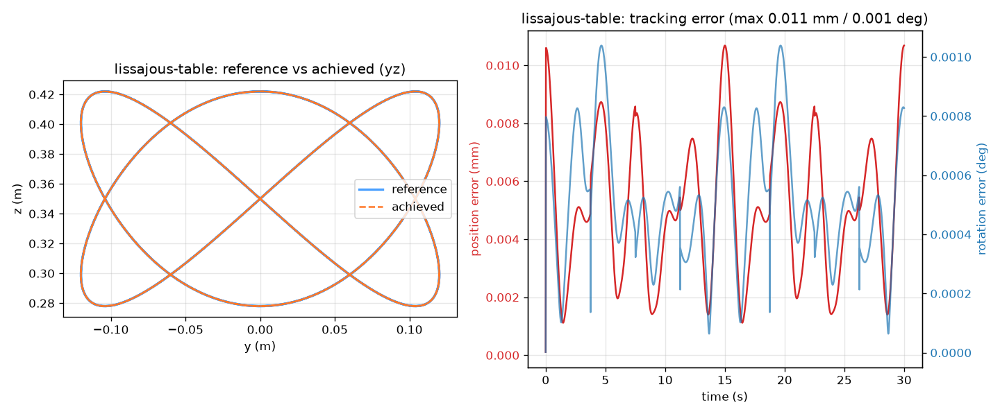

# Inverse Kinematics for a Franka FR3, from Scratch, Visualized Live

**Summary.** This project implements the full forward/inverse kinematics stack for a
7-DOF Franka Research 3 (FR3) arm *from scratch* — forward kinematics, an analytic
geometric Jacobian, and a damped least-squares (DLS) inverse-kinematics solver with a
nullspace posture task — and drives it live in a [Viser](https://viser.studio) browser
visualization. The end effector tracks sampled SE(3) reference trajectories (circle,
figure-8, lissajous) on two selectable drawing surfaces, or an interactive drag gizmo.
The reported numerical checks compare sampled configurations with PyRoKi and finite differences. Tracking errors are computed in the kinematic model; they do not measure physical robot accuracy.


---

## 1. Problem statement

Given a desired end-effector pose stream \(T_\text{des}(t) \in SE(3)\), find joint
configurations \(q(t) \in \mathbb{R}^7\) (within the FR3 joint limits) such that the
forward kinematics of the arm place the tool frame at \(T_\text{des}(t)\), and do so
smoothly enough to animate at ~50 Hz.

| | |
|---|---|
| **Input** | a target pose \(T_\text{des}\) (from a parametric trajectory or an interactive gizmo) and the current configuration \(q\) |
| **Output** | a new configuration \(q'\) whose FK tool pose matches \(T_\text{des}\) |
| **Success** | static targets solved to **< 1 mm / < 0.5°**; trajectory tracking with small, bounded error and no joint-limit violations or visible jumps |
| **Deliverable** | a live Viser app + recorded artifacts (CSV, error plots, GIF) + this report |

The interesting engineering is the **redundancy**: a 7-DOF arm solving a 6-DOF task has a
one-dimensional nullspace, which we exploit to keep a comfortable posture while still
hitting the task exactly.

---

## 2. System overview

```
trajectory.pose(shape, surface, t)  ──►  T_des ∈ SE(3)
                                           │
              interactive gizmo  ──────────┤
                                           ▼
   q ──►  DLSSolver.solve_step(q, T_des)  ──►  q'      (one bounded step)
                 │  uses FrankaModel.fk / .jacobian (from scratch)
                 ▼
        Scene (Viser): render arm, target gizmo, EE trace, mm/deg readout
```

- `src/franka_ik/robot_model.py` — FK + geometric Jacobian (M2)
- `src/franka_ik/ik.py` — DLS solver, nullspace posture, limit/step clamping (M3)
- `src/franka_ik/trajectory.py` — parametric SE(3) paths × drawing surfaces (M4)
- `src/franka_ik/visualizer.py` + `app.py` — live Viser app, GUI, ~50 Hz loop (M5)
- `src/franka_ik/record.py`, `scripts/record_gif.py` — headless artifacts (M6)

---

## 3. Method, stage by stage

### M0–M1 — Environment & rendering
A reproducible Python (≥3.10) environment; the official `franka_description` is cloned
and the FR3 URDF generated with relative mesh paths (`scripts/generate_urdf.py`). The arm
renders in Viser with joint sliders (`scripts/render_m1.py`), which also gives a visual
reference for the EE frame.

### M2 — Forward kinematics & the geometric Jacobian (from scratch)
FK composes the per-joint homogeneous transforms parsed from the URDF (fixed origins ×
the revolute rotation about each joint axis) out to the `fr3_hand_tcp` frame. The
**geometric Jacobian** is assembled analytically: for revolute joint \(i\) with world
axis \(z_i\) at position \(p_i\), and tool position \(p_e\),

\[
J_i = \begin{bmatrix} z_i \times (p_e - p_i) \\ z_i \end{bmatrix} \in \mathbb{R}^6 .
\]

**Validation (9/9 checks):** FK poses match `yourdfpy` and PyRoKi on random configs; the
Jacobian matches PyRoKi and central finite differences to machine precision
(max deviation ~\(9\times10^{-16}\); relative error-vs-Jacobian ~\(6\times10^{-6}\)).
Details in `notes/stage-2-notes.md`, gate `scripts/validate_kinematics.py`.

### M3 — Damped least-squares IK with a nullspace posture task
The pose error is a 6-vector twist: position error \(e_p = p_\text{des} - p_\text{cur}\)
and orientation error \(e_o = \log\!\big(R_\text{des} R_\text{cur}^\top\big)^\vee\) via the
SO(3) log map. The DLS (Levenberg–Marquardt) step is

\[
\Delta q = J^\top \big(J J^\top + \lambda^2 I\big)^{-1} e,
\]

which stays well-conditioned through singularities where the raw pseudoinverse blows up.
The redundant DOF is used by a **nullspace posture task** that gently pulls \(q\) toward a
rest posture without disturbing the task:

\[
\Delta q \mathrel{+}= \big(I - J^{+}J\big)\, k_0 (q_\text{rest} - q).
\]

Each step is clamped to joint limits and to a maximum per-frame magnitude
(`max_step`), so motion is smooth and legal. **Tuning** (documented and justified in
`notes/stage-3-notes.md`) settled on \(\lambda = 0.01\), posture gain \(0.05\),
`max_step = 0.1` rad. **Validation (12/12 tests):** 50/50 random reachable targets solved
< 1 mm / 0.5°; robust behavior at singularities; no limit violations.

### M4–M5 — Trajectories, drawing surfaces, and the live app
A trajectory is `shape × surface`:

- **shape** — the in-plane curve: `circle`, `figure-8` (Gerono lemniscate), or
  `lissajous` (a genuinely 3D path that also *rotates* the tool via a slerp wobble, so
  orientation tracking is exercised, not just position).
- **surface** — *where* the curve is drawn *and how the tool is held*, so the gripper
  "pen" points **into** the plane rather than lying flat in it (see §5):

| surface | plane | gripper points | center | radius |
|---|---|---|---|---|
| `table` | horizontal (XY) | straight down | (0.45, 0, 0.35) | 0.12 m |
| `wall` | vertical (YZ), faces robot | forward (+x) | (0.50, 0, 0.50) | 0.10 m |

The Viser app runs a ~50 Hz loop: read the target (trajectory or gizmo), take one bounded
`solve_step`, render the arm, the RGB target gizmo, a growing end-effector trace, and a
live mm/deg error readout. GUI controls expose the mode, shape, surface, speed, the four
solver gains (live), and pause/reset. **Interactive mode** snaps the gizmo to the current
fingertip (no jump) and then the arm follows the dragged target in real time.

### M6 — Artifacts
`record.py` produces per-combo CSV + error plots headlessly; `record_gif.py` renders the
demo GIF above by driving the exact live pipeline. This report is the writeup.

---

## 4. Results

**Kinematics (M2):** 9/9 — FK and Jacobian match PyRoKi + finite differences to machine
precision.

**Static IK (M3):** 50/50 random reachable targets < 1 mm / 0.5°; 12/12 solver tests.

**Trajectory tracking (M4/M5): 18/18 tests reported.** The six `shape × surface` combinations, each exercised over two periods,
track far under the 1 mm / 0.5° bar:

| combo | max position error | combo | max position error |
|---|---|---|---|
| circle · table | 0.008 mm | circle · wall | 0.031 mm |
| figure-8 · table | 0.006 mm | figure-8 · wall | 0.031 mm |
| lissajous · table | 0.011 mm | lissajous · wall | 0.013 mm |

| `table` — reference vs achieved + error-vs-time | `wall` — reference vs achieved + error-vs-time |
|---|---|
|  |  |

The reference (blue) and calculated end-effector (orange) curves nearly overlap at the plotted scale. Reported maximum errors across the paths range from 0.006 to 0.031 mm. The `lissajous`
path additionally confirms **orientation** tracking under a moving frame:



**Regression:** M2 (9/9) and M3 (12/12) gates remain green after all M4–M6 work.

---

## 5. Engineering challenges & fixes

- **"Drawing" looked like "waving."** With the tool at its home (gripper-down) orientation
  on a *vertical* circle, the tool approach axis lay **flat in** the drawing plane (~90° to
  the normal) instead of pointing **into** it. The numbers were perfect but the motion read
  wrong. Fix: couple the plane and tool orientation via the `surface` abstraction (§3) so
  the pen always stabs into the disk (0° to the normal), and add a permanent regression
  check (**TR5**, pen-into-plane) that also localizes the responsible stage (trajectory
  geometry, not FK/Jacobian/solver). Details: `notes/stage-4-notes.md` §9.
- **`wall` surface unreachable at first.** The initial vertical circle poked past the FR3's
  wrist limits (max 11.8 mm error). A small empirical search over center/radius found a
  configuration (0.50, 0, 0.50), r = 0.10 that is reachable everywhere (< 0.1 mm), now
  guarded by the reachability test (**TR4**).
- **Error readout showed `0`.** Viser's `add_number` infers display precision from the
  initial value; with `0.0` it rounded sub-millimetre errors to zero. Fix: `step=1e-4`.
- **Module resolution under iCloud.** The `~/Desktop` iCloud sync intermittently broke the
  editable install's `.pth` file, so `python -m franka_ik.*` sometimes failed to import.
  Fix: run entry points with `PYTHONPATH=src` (the same `src`-on-path convention the test
  scripts already use); `pyproject.toml` is retained for standard packaging.

---

## 6. Design decisions & trade-offs

- **DLS over the raw pseudoinverse** — trades a tiny steady-state error for singularity
  robustness (visible in the live λ stress test in `notes/stage-4-notes.md` §8: raising
  damping to 0.5 makes the arm lag the target ~1500×, then snaps back when restored).
- **Nullspace posture over hard postural constraints** — keeps the arm comfortable while minimizing changes to the primary task locally; the redundant DOF is visibly reconfiguring while the
  fingertip stays glued to the path.
- **Bounded `solve_step` per frame over solve-to-convergence** — bounds numerical joint updates; a physical controller would require additional dynamics and motion-limit handling.
- **From-scratch FK/Jacobian, validated against PyRoKi** — the assignment's core; PyRoKi
  and finite differences are used only as independent oracles, never in the solver.

---

## 7. Limitations & future work

- **No self-collision or environment-collision checking** — targets are assumed to be in
  free space. Adding a collision cost or check would harden interactive mode.
- **Position limits and per-step magnitude are enforced, but not joint velocity/acceleration
  limits** — fine for visualization, but a real controller would bound \(\dot q, \ddot q\).
- **Local solver** — DLS is a local method; a wildly out-of-reach interactive target can
  stall at a limit rather than finding a global reconfiguration.
- **Second-order / weighted tasks** — a task-priority stack or weighted DLS could trade off
  position vs orientation explicitly.
- **Numerical coverage** — tests sample reachable configurations and selected trajectories. They do not establish global convergence or hardware-safe motion. The repository includes a CI workflow for repeatable checks.

Possible extensions include collision checks, motion limits, and broader pose/trajectory coverage.

---

## 8. Reproduce

```bash
python3.12 -m venv .venv && source .venv/bin/activate
pip install -r requirements.txt
git clone https://github.com/frankarobotics/franka_description assets/franka_description
python scripts/generate_urdf.py

python scripts/validate_kinematics.py      # M2: 9/9
python scripts/test_ik.py                  # M3: 12/12
PYTHONPATH=src python scripts/test_trajectory.py   # M4/M5: 18/18

PYTHONPATH=src python -m franka_ik.app             # live demo (Surface: table/wall)
PYTHONPATH=src python -m franka_ik.record --all    # error CSV + plots
PYTHONPATH=src python scripts/record_gif.py        # demo GIF
```

---

## 9. References

**Damped least squares / singularity-robust IK**
1. Y. Nakamura and H. Hanafusa, "Inverse Kinematic Solutions With Singularity Robustness
   for Robot Manipulator Control," *ASME J. Dyn. Sys., Meas., Control*, 108(3), 1986.
2. C. W. Wampler, "Manipulator Inverse Kinematic Solutions Based on Vector Formulations
   and Damped Least-Squares Methods," *IEEE Trans. Systems, Man, and Cybernetics*,
   16(1), 1986.
3. S. R. Buss, "Introduction to Inverse Kinematics with Jacobian Transpose, Pseudoinverse
   and Damped Least Squares Methods," technical note, UC San Diego, 2004.

**Redundancy / nullspace posture**
4. A. Liégeois, "Automatic Supervisory Control of the Configuration and Behavior of
   Multibody Mechanisms," *IEEE Trans. Systems, Man, and Cybernetics*, 7(12), 1977.
5. B. Siciliano, L. Sciavicco, L. Villani, and G. Oriolo, *Robotics: Modelling, Planning
   and Control*, Springer, 2009 (closed-loop inverse kinematics, geometric Jacobian).

**Lie-group pose error**
6. J. Solà, J. Deray, and D. Atchuthan, "A micro Lie theory for state estimation in
   robotics," arXiv:1812.01537, 2018 (SO(3)/SE(3) log map used for orientation error).

**Tools & models**
7. Viser — web-based 3D visualization, Nerfstudio project. https://viser.studio
8. PyRoKi — JAX kinematics toolkit (independent FK/Jacobian oracle),
   https://github.com/chungmin99/pyroki
9. `yourdfpy` — URDF parsing/visualization. https://github.com/clemense/yourdfpy
10. Franka Robotics, `franka_description` (FR3 URDF and meshes).
    https://github.com/frankarobotics/franka_description
