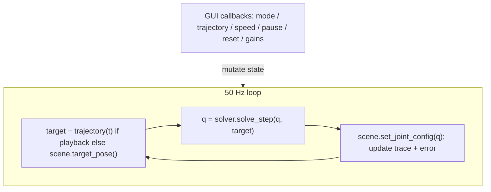
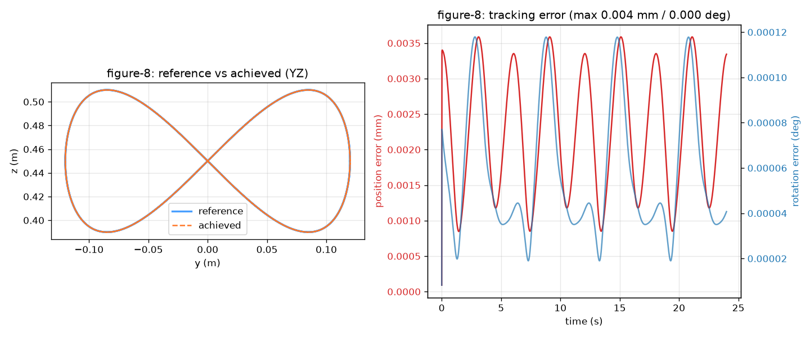
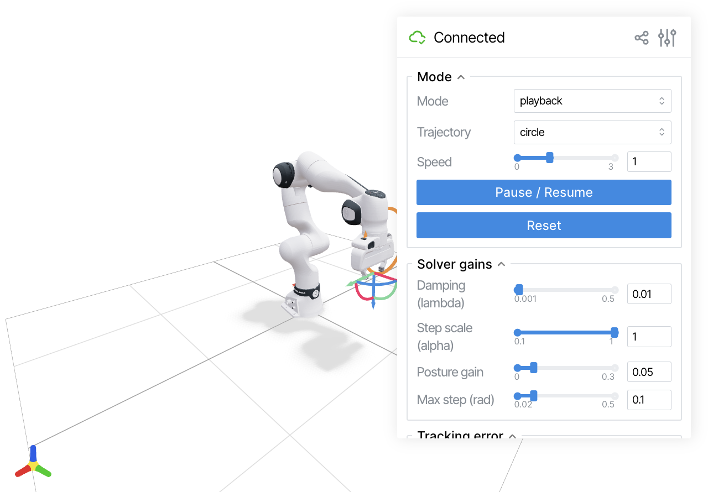
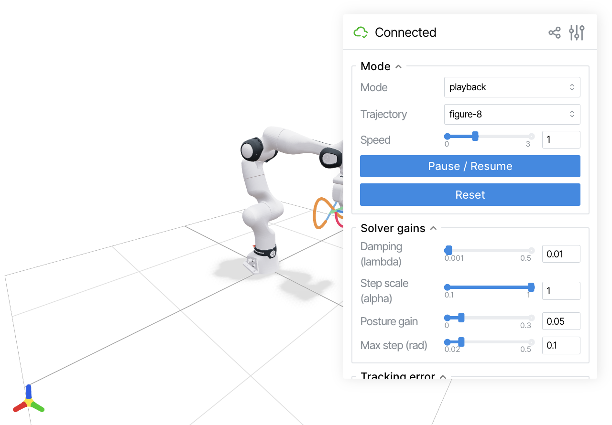
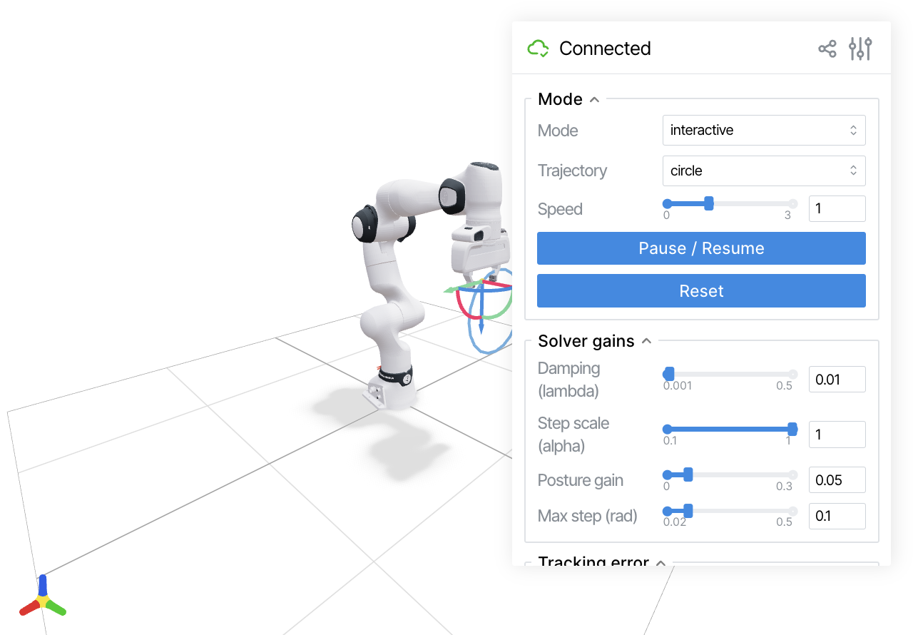

# Stage 4 Notes — Trajectories, the Viser App, and Live Tracking (M4 + M5)

Companion notes to [DESIGN.md §3.3–3.5](../DESIGN.md). This is the stage where the
project becomes *visible*: the validated solver (M3) is wired to a moving target and a
browser renderer, so the FR3 physically traces reference paths. Stages 1–3 built and
proved every piece; here we assemble them and add the two things the assignment asks
for by name — sampled pose trajectories and Viser visualization — plus the offline
recorder that produces the artifact.

Because M3 already proved `solve_step` tracks a circle at 0.006 mm, the risk in this
stage is *not* the IK math. It is (a) building trajectories that stay reachable, (b)
wiring Viser correctly (joint ordering, quaternion conventions, gizmo feedback loops),
and (c) keeping a real-time loop smooth. The tests target exactly those.

---

## 1. Trajectories: what to sample and why

A trajectory is a function \( T_{des}(t) \in SE(3) \) — a moving pose the hand should
follow. All three paths live in a reachable region in front of the base
(center \( c = [0.45, 0, 0.45] \) m, radius \( \le 0.12 \) m, well inside the ~0.85 m
reach envelope and away from the singular stretched-out boundary — the same region the
M3 tracking test already validated).

- **circle** — center + \( [0, r\cos\theta, r\sin\theta] \), \( \theta = 2\pi t/T \):
  a circle in the YZ plane (the vertical plane facing the robot). Simplest path;
  constant curvature; the M3 prototype (`circle_path` in `test_ik.py`) already tracks
  it at micrometre error. Position-only motion, orientation held constant.
- **figure_eight** — a Gerono lemniscate: \( y = r\cos\theta \), \( z = \tfrac{r}{2}\sin 2\theta \).
  Self-crossing path with sign-changing curvature and a speed that varies around the
  loop — a harder tracking test than the circle, still smooth and closed.
- **lissajous** — a 3D path (\( x, y, z \) each a sinusoid at a different frequency)
  **with orientation that slerps** between keyframes over the cycle. This is the only
  path that exercises *rotation* tracking; the others hold orientation fixed. Slerp
  (spherical linear interpolation, via scipy's `Slerp`) gives a constant-angular-speed,
  shortest-arc interpolation between orientation keyframes — the correct way to move
  through SO(3), as opposed to interpolating Euler angles or matrix entries.

Default orientation is "gripper pointing down/forward", taken as the orientation of
`fk(q_home)` so frame 0 of every path is trivially reachable from home. Each path is
periodic with period \( T \) (seconds), so playback loops seamlessly.

Interface: each is a pure function `(t, period, radius) -> (4,4)` and they are
collected in a `TRAJECTORIES` dict keyed by the GUI dropdown labels.

## 2. The Scene wrapper (visualizer.py)

A `Scene` class hides all Viser calls behind a small interface the app loop uses:

- `set_joint_config(q)` — maps our 7 arm angles by joint *name* into the actuated
  vector ViserUrdf expects (finger joint appended, fixed open), then `update_cfg`.
  Mapping by name, not position, is deliberate: it is robust to ViserUrdf ordering the
  actuated joints differently than our chain (a bug class we avoided in M2 too).
- `target_pose() -> (4,4)` — reads the `transform_controls` gizmo (position + wxyz
  quaternion) in interactive mode.
- `set_target(T)` — moves the gizmo to a pose; used both to show the playback target
  and, critically, to *snap the gizmo to the current EE pose* when switching into
  interactive mode so the arm never jumps (see §3).
- `draw_reference(points)` — the reference path as a Catmull–Rom spline.
- `append_ee_trace(point)` / rolling buffer — the achieved EE path as live line
  segments, capped to a fixed length so it stays a "comet tail" and memory is bounded.
- `set_error(pos_mm, rot_deg)` — writes the two disabled number readouts.
- GUI handles exposed as attributes: mode dropdown, trajectory dropdown, speed slider,
  pause/reset buttons, and the four solver sliders (damping, step scale, posture gain,
  max_step) wired to mutate the live `IKConfig`.

Quaternion convention: Viser uses wxyz; scipy uses xyzw. All matrix<->quaternion
conversion goes through two tiny helpers (`mat_to_wxyz`, `wxyz_to_mat`) so the
convention lives in exactly one place — the same discipline that kept M2's comparisons
honest.

## 3. The app loop (app.py)



Design points:

- **Fixed ~50 Hz tick** via sleeping the remainder of each 20 ms frame; the trajectory
  clock advances by `speed * dt` so the speed slider changes path velocity without
  changing the frame rate.
- **One `solve_step` per frame** — never a full `solve` — this is what makes motion
  smooth (M3 §4: consecutive configs are one bounded step apart).
- **Mode switch without a jump.** On entering interactive mode, snap the gizmo to the
  current EE pose so `target_pose()` returns where the arm already is; on entering
  playback, resume from the trajectory clock. Either way the target never
  discontinuously jumps, so the arm never lurches.
- **Reset** restores `q_home` and clears the trace. **Pause** freezes the clock but
  keeps the server responsive.
- Runs headless-friendly (`python -m franka_ik.app`), printing the localhost URL.

## 4. The recorder (record.py)

Headless (no browser): runs a chosen trajectory for N periods at 50 Hz through the same
solver, logging per frame `t`, target position, achieved position, and the position/
rotation errors. Outputs to `outputs/`:

- `tracking_<traj>.csv` — the raw log (reproducible source for any later plot).
- `tracking_<traj>.png` — two panels: (i) reference vs. achieved path in 3D/2D, (ii)
  position (mm) and rotation (deg) error vs. time. This is the quantitative artifact
  for the README and report (M6).

Sharing the exact solver + trajectory code with the live app means the recorded numbers
are the same ones the demo shows — no separate "benchmark" path to drift out of sync.

## 5. Test plan

Same two-layer pattern as M2/M3, in [scripts/test_trajectory.py](../scripts/test_trajectory.py).

**Isolated (trajectory correctness):**

| # | Test | Why |
|---|------|-----|
| TR1 | every sampled pose is a valid SE(3): R orthonormal, det +1 | a malformed target would poison the solver |
| TR2 | continuity: consecutive samples at 50 Hz are close in position and rotation | discontinuities would demand infinite joint velocity |
| TR3 | periodicity: \( T_{des}(0) = T_{des}(\text{period}) \) | playback must loop seamlessly |
| TR4 | reachability: a static `solve` converges to samples spanning each path | proves the path lives in the workspace, not asserted |

**Pipeline (tracking + integration):**

| # | Test | Why |
|---|------|-----|
| TP1 | track each trajectory one step/frame @ 50 Hz; max/RMS error under 1 mm / 0.5° | the assignment's core deliverable, per path |
| TP2 | smoothness: per-frame \|Δq\| ≤ max_step; all configs in-limits | quantifies "smooth" |
| TP3 | recorder produces CSV + PNG with sane contents | the artifact actually generates |
| TP4 | regression: M2 (`validate_kinematics`) and M3 (`test_ik`) gates still green | no cross-stage breakage |

Browser verification (manual, screenshotted): robot tracking the circle in playback,
the drag gizmo moving the arm in interactive mode, and the full GUI present.

## 6. Results

Built the three stubs plus the recorder: `trajectory.py`, `visualizer.py`, `app.py`,
`record.py`. All Stage 4 tests pass and the M2/M3 gates still pass (no regressions).

### Isolated + pipeline tests (`scripts/test_trajectory.py`, 11/11)

```
TR1 valid SE(3):   max orthonormality/det error = 8.88e-16
TR2 continuity:    max per-frame 2.75 mm / 0.172 deg   (smooth at 50 Hz)
TR3 periodicity:   max |pose(0) - pose(period)| = 4.34e-16
TR4 reachability:  circle 12/12; figure-8 12/12; lissajous 12/12
TP1 track circle:     max 0.006 mm / 0.000 deg,  RMS 0.005 mm
TP1 track figure-8:   max 0.004 mm / 0.000 deg,  RMS 0.002 mm
TP1 track lissajous:  max 0.011 mm / 0.001 deg,  RMS 0.006 mm
TP2 smoothness:    max per-frame |dq| <= 0.009 rad, all configs in-limits
TP3 recorder:      CSV 401 rows + PNG produced
```

Every path is tracked ~2-3 orders of magnitude under the 1 mm / 0.5 deg bar. The
lissajous path — the only one with changing orientation — confirms rotation tracking
(0.001 deg), not just translation. This matches the M3 finding that with defaults
(lambda=0.01, alpha=1.0) consecutive-target tracking is essentially exact.

### Recorded artifact (`python -m franka_ik.record --all --periods 2`)

| trajectory | max pos err | max rot err | files |
|---|---|---|---|
| circle | 0.0065 mm | 0.0001 deg | `outputs/tracking_circle.{csv,png}` |
| figure-8 | 0.0036 mm | 0.0001 deg | `outputs/tracking_figure-8.{csv,png}` |
| lissajous | 0.0109 mm | 0.0010 deg | `outputs/tracking_lissajous.{csv,png}` |

The figure-8 plot (reference vs. achieved overlap on the left, periodic error-vs-time on
the right) is representative (CSVs regenerate into gitignored `outputs/`; a copy of each
plot is committed under `docs/images/`):



### Live app (browser, `PYTHONPATH=src python -m franka_ik.app`)

Playback mode tracking the circle, with the blue reference spline, the orange live EE
trace, the target gizmo, and the full GUI (mode/trajectory dropdowns, speed, pause/reset,
the four solver sliders, and the mm/deg readouts showing ~0.003 mm live):



Selecting figure-8 redraws the reference and the arm traces the lemniscate:



Interactive mode: switching modes snaps the gizmo to the current EE pose (no arm jump),
and the gizmo's translate/rotate handles become the IK target:



### Regression gates (still green)

- M2 `scripts/validate_kinematics.py`: 9/9 (FK vs yourdfpy/PyRoKi, Jacobian vs finite
  differences and JAX, all < 1e-5).
- M3 `scripts/test_ik.py`: 12/12 (T1-T8 isolated + P1/P2/P4 pipeline).

## 7. Issues found and fixes

- **Packaging / running as `-m`.** This repo lives under an iCloud-synced `~/Desktop`
  path. The setuptools *editable* install (`pip install -e .`) writes an
  `__editable__*.pth`, but `site` **silently skips a `.pth` it can't open**
  (`addpackage` swallows `OSError`), and iCloud intermittently makes the file
  unreadable — so `python -m franka_ik.app` failed nondeterministically. Fix: run the
  package modules with `PYTHONPATH=src` (the same `src`-on-path convention the
  `scripts/*.py` already use with `sys.path.insert`), which is deterministic and needs
  no install. `pyproject.toml` is kept for normal (non-synced) environments where
  `pip install -e .` works fine.
- **Error readout displayed `0`.** Viser's `add_number` infers display precision from
  the initial value, so `0.0` rendered sub-millimetre errors as `0`. Fix: pass
  `step=1e-4` to the two readouts so the true ~0.003 mm value is visible.
- **Trace/reference bookkeeping on mode/trajectory switch.** Changing trajectory or
  mode now clears the rolling EE trace and (for trajectory) redraws the reference, so
  stale geometry never lingers.
